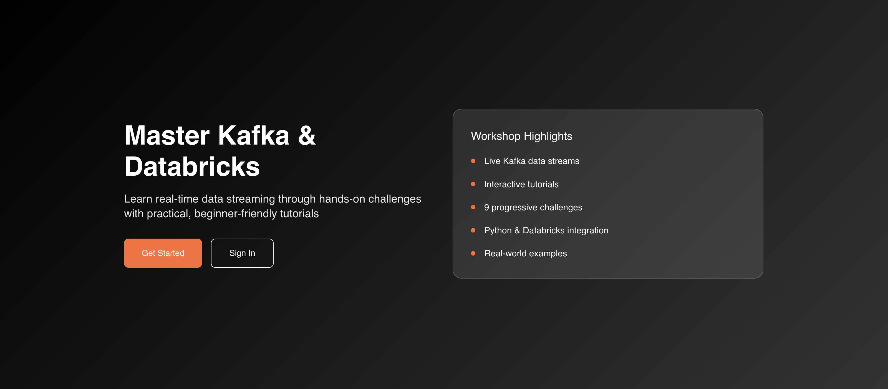
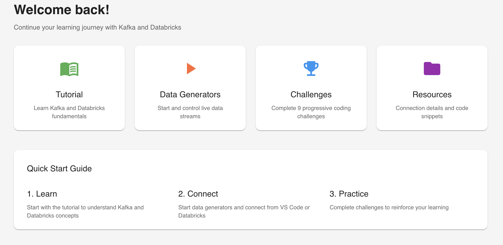
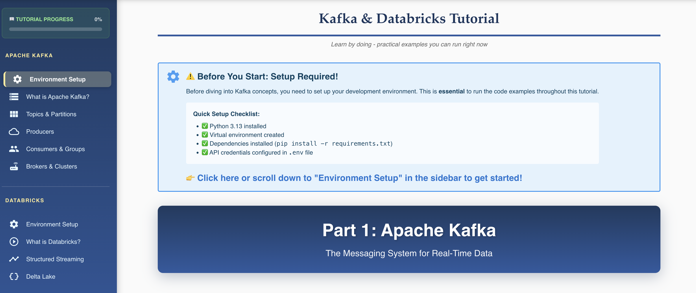
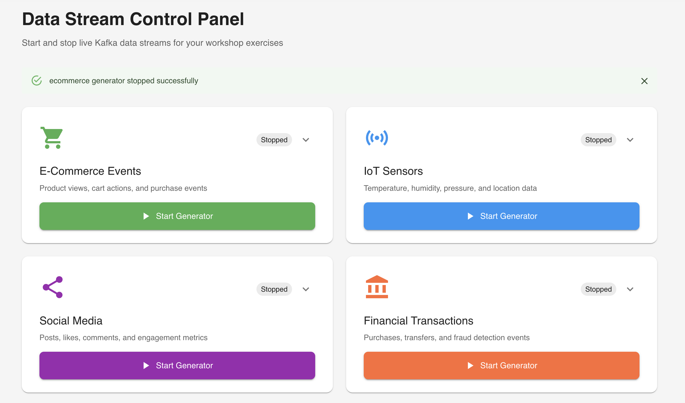
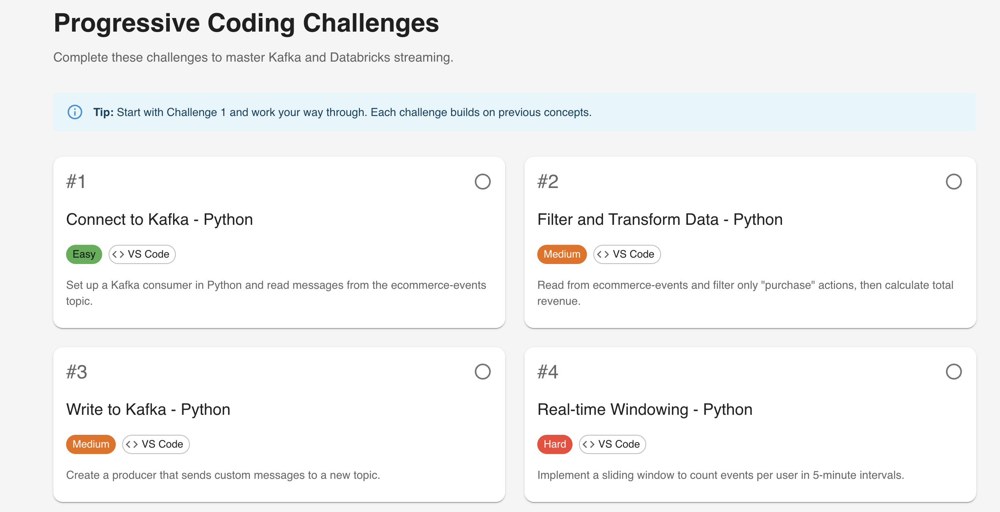

# 🚀 Real-Time Data Streaming Workshop
## Master Apache Kafka & Databricks Structured Streaming

---

### **Transform Your Understanding of Real-Time Data**

Welcome to an immersive, hands-on workshop where you'll build production-grade streaming data pipelines from scratch. No theory-only slides—you'll write real code, process live data, and see results instantly.

---

## 🎯 What You'll Build

By the end of this workshop, you will have created:

✅ **Live data producers** that generate e-commerce events in real-time
✅ **Kafka topics** to reliably stream millions of messages
✅ **Python consumers** to process streaming data
✅ **Databricks pipelines** that transform streams into analytics-ready tables
✅ **Delta Lake tables** with ACID transactions and time travel capabilities

---

## 🌟 Why This Workshop Stands Out

### **Interactive Learning Platform**
Our custom-built workshop application provides:
- **Step-by-step tutorials** with code examples you can copy and paste
- **Live data generation** - create realistic e-commerce events on demand
- **Progress tracking** - gamified learning experience with achievements
- **Instant feedback** - test your Kafka setup in real-time
- **Challenge mode** - test your knowledge with hands-on exercises

### **Real-World Scenarios**
Learn using realistic examples:
- E-commerce order processing
- User activity tracking
- Product analytics
- Real-time notifications

---

## 📚 Workshop Structure

### **Part 1: Apache Kafka Fundamentals** (90 minutes)
Master the world's most popular event streaming platform:

#### What You'll Learn:
- ⚡ **Core Concepts**: Topics, Partitions, Producers, Consumers
- 🏗️ **Architecture**: Brokers, Clusters, and how Kafka scales
- 🔐 **Security**: SASL/SSL authentication with Confluent Cloud
- 🐍 **Python Integration**: Building producers and consumers
- 📊 **Consumer Groups**: Load balancing and fault tolerance

#### Hands-On Activities:
```python
# You'll write code like this:
producer.send('ecommerce-events', {
    'user_id': 'user_123',
    'action': 'purchase',
    'product': {'id': 'prod_456', 'price': 99.99}
})
```

---

### **Part 2: Databricks Structured Streaming** (90 minutes)
Process infinite data streams with Apache Spark:

#### What You'll Learn:
- 🌊 **Streaming DataFrames**: Process data as it arrives
- 🔄 **Transformations**: Parse JSON, filter, aggregate in real-time
- 💾 **Delta Lake**: ACID transactions for streaming data
- 🎯 **Unity Catalog**: Organize data with modern governance
- ⚙️ **Fault Tolerance**: Checkpointing and exactly-once processing

#### Hands-On Activities:
```python
# You'll build streaming pipelines like this:
spark.readStream \
  .format("kafka") \
  .option("subscribe", "ecommerce-events") \
  .load() \
  .writeStream \
  .format("delta") \
  .table("ecommerce_analytics")
```

---

### **Part 3: Code Examples & Best Practices** (60 minutes)
Ready-to-use production patterns:

- 📝 **Complete examples** for common use cases
- 🏭 **Production patterns**: Error handling, monitoring, optimization
- 🧪 **Testing strategies**: Validating streaming applications
- 📈 **Performance tuning**: Throughput and latency optimization

---

## 🛠️ What You'll Use

### **Technologies & Tools**
| Technology | Purpose | You'll Learn |
|------------|---------|--------------|
| **Apache Kafka** | Event Streaming | Producers, consumers, topics |
| **Confluent Cloud** | Managed Kafka | Cloud-native streaming |
| **Python** | Client Development | kafka-python library |
| **Databricks** | Spark Processing | Structured Streaming |
| **Delta Lake** | Data Storage | ACID transactions |
| **Unity Catalog** | Data Governance | Modern data organization |

### **Workshop Platform Features**
- 🏠 **Interactive Home Page** - Your learning hub
- 📖 **Comprehensive Tutorials** - Step-by-step guides
- 🎮 **Live Data Generator** - Create streaming events on demand
- 🏆 **Progress Dashboard** - Track your achievements
- 💪 **Challenge Mode** - Test your skills

---

## 📋 Prerequisites

### **Required Knowledge**
- ✅ Basic Python programming
- ✅ Understanding of JSON data format
- ✅ Familiarity with command line/terminal
- ✅ Basic SQL knowledge (helpful but not required)

### **Required Setup** (We'll help you configure these)
- 💻 Python 3.8+ installed
- 🔑 Confluent Cloud account (free tier available)
- ☁️ Databricks Community Edition account (free)
- 🌐 Internet connection

### **Nice to Have** (Not Required)
- Knowledge of distributed systems
- Experience with Apache Spark
- Familiarity with data pipelines

---

## 🎁 What You'll Take Home

### **Skills**
✅ Ability to design and implement real-time data pipelines
✅ Hands-on experience with industry-standard tools
✅ Understanding of streaming vs. batch processing
✅ Production-ready code patterns and best practices

### **Resources**
📦 **Complete code examples** - Production-ready templates
📚 **Comprehensive tutorial** - Available online forever
🔗 **Reference materials** - Kafka and Spark documentation
🎯 **Workshop platform access** - Practice anytime

### **Certificate** (Optional)
🏅 Complete the challenge section for a certificate of completion

---

## 👥 Who Should Attend?

### **Perfect For:**
- 🎓 **Data Engineers** wanting to master streaming
- 💻 **Software Engineers** building real-time features
- 📊 **Data Analysts** ready to work with live data
- 🔬 **Data Scientists** needing real-time ML pipelines
- 🎯 **Students** exploring modern data engineering

### **You'll Succeed If You:**
- Love hands-on learning (we code together!)
- Want to build real-world projects
- Are curious about how platforms like Uber, Netflix, and LinkedIn process data
- Enjoy problem-solving and debugging
- Are ready to ask questions and experiment

---

## 🌐 Workshop Platform Preview

### **1. Welcome Home**


**Master Kafka & Databricks** - Your journey begins here! Our sleek landing page welcomes you with:
- **Get Started** button to jump right into learning
- **Workshop Highlights** at a glance:
  - Live Kafka data streams
  - Interactive tutorials
  - 9 progressive challenges
  - Python & Databricks integration
  - Real-world examples

The modern, dark-themed interface sets the tone for a professional learning experience.

---

### **2. Dashboard Overview**


**Welcome back!** Continue your learning journey from where you left off. The dashboard features:
- **4 Main Sections**:
  - 📖 **Tutorial** - Learn Kafka and Databricks fundamentals
  - ▶️ **Data Generators** - Start and control live data streams
  - 🏆 **Challenges** - Complete 9 progressive coding challenges
  - 📁 **Resources** - Connection details and code snippets

**Quick Start Guide** provides a clear 3-step path:
1. **Learn** - Start with the tutorial to understand Kafka and Databricks concepts
2. **Connect** - Start data generators and connect from VS Code or Databricks
3. **Practice** - Complete challenges to reinforce your learning

---

### **3. Interactive Tutorials**


**Kafka & Databricks Tutorial** - Your comprehensive learning companion:
- **Progress Tracking** - Sidebar shows your completion percentage (0% to start!)
- **Structured Content**:
  - **Part 1: Apache Kafka** - Topics, Partitions, Producers, Consumers, Brokers & Clusters
  - **Part 2: Databricks** - Environment Setup, What is Databricks?, Structured Streaming, Delta Lake

**Before You Start** setup checklist ensures you have:
- ✅ Python 3.13 installed
- ✅ Virtual environment created
- ✅ kafka-python library (`pip install --requirements.txt`)
- ✅ API credentials configured in .env file

Every section includes syntax-highlighted code examples you can copy and paste directly into your editor.

---

### **4. Live Data Generator**


**Data Stream Control Panel** - Your streaming data laboratory:

Start and stop live Kafka data streams for your workshop exercises. Four realistic data generators:

1. **🛒 E-Commerce Events** (Green) - Product views, cart actions, and purchase events
2. **📡 IoT Sensors** (Blue) - Temperature, humidity, pressure, and location data
3. **📱 Social Media** (Purple) - Posts, likes, comments, and engagement metrics
4. **🏦 Financial Transactions** (Orange) - Purchases, transfers, and fraud detection events

Each generator has:
- **Status indicator** showing "Stopped" or "Running"
- **Start Generator** button to begin streaming data
- **Dropdown menu** for additional controls

Success notifications appear when generators start successfully!

---

### **5. Challenge Yourself**


**Progressive Coding Challenges** - Test your mastery step by step:

Complete these hands-on challenges to solidify your learning:

**Challenge #1: Connect to Kafka - Python** ✅ VS Code
*Set up a Kafka consumer in Python and read messages from the ecommerce-events topic*

**Challenge #2: Filter and Transform Data - Python** 🔶 VS Code
*Read from ecommerce-events and filter only "purchase" actions, then calculate total revenue*

**Challenge #3: Write to Kafka - Python** 🔶 VS Code
*Create a producer that sends custom messages to a new topic*

**Challenge #4: Real-time Windowing - Python** 🔴 VS Code
*Implement a sliding window to count events per user in 5-minute intervals*

Each challenge card shows:
- **Difficulty level** - Easy (green), Medium (orange), Hard (red)
- **Platform** - VS Code or Databricks
- **Clear objectives** explaining what you'll build

Start with Challenge #1 and work your way through - each builds on previous concepts!

---

## 🚀 Ready to Start?

### **Before the Workshop:**
1. 📧 Check your email for workshop access link
2. 🔐 Create Confluent Cloud account (instructions provided)
3. ☁️ Sign up for Databricks Community Edition
4. 💻 Install Python 3.8+ on your machine
5. 📖 Visit the workshop platform to familiarize yourself

### **Workshop Day:**
- ⏰ Arrive 15 minutes early for setup help
- 💻 Bring a laptop with 4GB+ RAM
- 🔌 Ensure stable internet connection
- 📝 Have a notepad for questions
- ☕ Bring water/coffee - it's an intensive session!

### **Workshop Access:**
🌐 **Platform URL**: [Will be provided via email]
📅 **Date**: [To be announced]
⏰ **Time**: [To be announced]
📍 **Location**: [Virtual/In-person details]

---

## 💬 Questions?

### **Common Questions Answered:**

**Q: Is this workshop beginner-friendly?**
A: Yes! If you know basic Python, you're ready. We explain everything step-by-step.

**Q: Do I need to pay for cloud services?**
A: No! We use free tiers: Confluent Cloud free trial + Databricks Community Edition.

**Q: What if I get stuck during the workshop?**
A: Instructors are available throughout. Plus, our platform has troubleshooting guides.

**Q: Can I access the materials after the workshop?**
A: Absolutely! The platform and all tutorials remain available online.

**Q: Will there be breaks?**
A: Yes! We have scheduled breaks and encourage asking questions anytime.

---

## 🎓 Learning Outcomes

By completing this workshop, you will be able to:

✅ **Explain** the architecture and use cases for Apache Kafka
✅ **Design** scalable event-driven systems
✅ **Implement** Kafka producers and consumers in Python
✅ **Build** real-time data pipelines with Databricks
✅ **Process** streaming data with Spark Structured Streaming
✅ **Store** streaming results in Delta Lake with ACID guarantees
✅ **Troubleshoot** common Kafka and Spark streaming issues
✅ **Apply** best practices for production deployments

---

## 🌟 Join the Real-Time Revolution

The future of data is streaming. Companies like Uber, LinkedIn, Netflix, and Airbnb process billions of events per day using Kafka and Spark. This workshop gives you the exact skills they use.

### **Don't just learn about streaming data—build it!**

---

## 📞 Contact & Support

**Workshop Organizer**: [Your Name/Organization]
**Email**: [contact@example.com]
**Platform**: [Workshop URL]

**Technical Support**: Available 24/7 via platform chat

---

### **See You at the Workshop! 🎉**

*This is not just a workshop—it's your gateway to mastering real-time data engineering.*

---

**Share this with colleagues who'd love to learn streaming!**

#DataEngineering #ApacheKafka #Databricks #RealTime #Streaming #BigData
